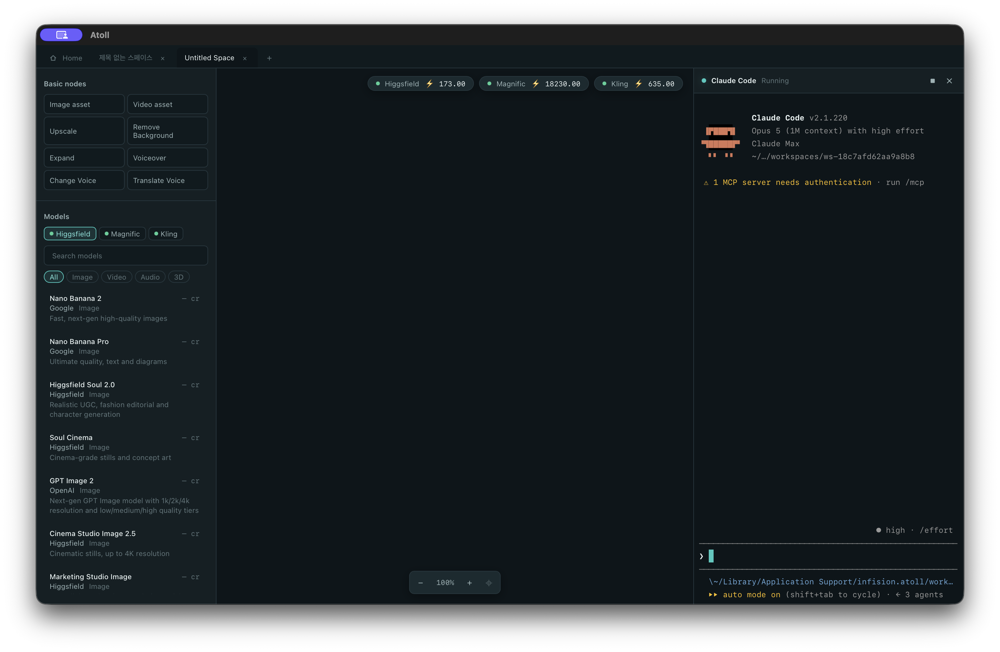
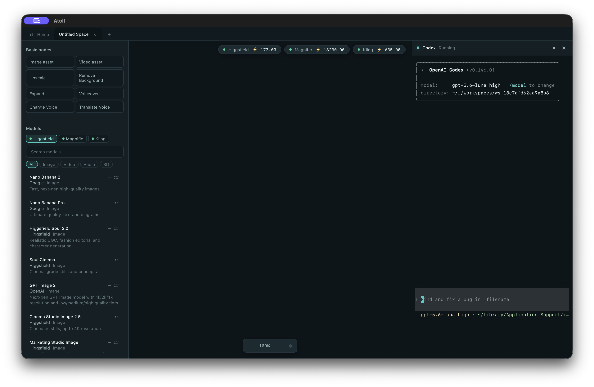

<div align="center">

# 🏝️ Atoll

**A canvas-based AI generation studio that puts every MCP provider — and your coding agent — on one node graph.**

[](LICENSE)
[](https://tauri.app)
[](https://react.dev)
[](https://www.rust-lang.org)
[](#contributing)

[Why Atoll](#why-atoll) • [Highlights](#highlights) • [Getting Started](#getting-started) • [Agent Integration](#agent-integration) • [Architecture](#architecture) • [Contributing](#contributing)



</div>

---

Atoll is a local-first desktop app for creators. Connect AI generation providers (Higgsfield, Magnific, Kling, …) through [MCP](https://modelcontextprotocol.io), sign in with **your own accounts**, and compose image / video / audio / 3D generation into a **node-graph canvas** — with live credit balances, cost estimates before you run, and every result cached on your disk.

And here's the twist: the canvas has a **terminal**. Claude Code or Codex runs docked next to your graph, sees the canvas through a local MCP server, and builds workflows with you — *"make a lighthouse image node and run it"* is a valid way to use Atoll.

## Why Atoll

Creator workflows today are scattered across browser tabs — one per provider, each with its own credits, history, and download folder. Atoll pulls them into a single instrument:

- **One canvas, many providers.** Each node is a model call; edges pipe outputs into inputs across providers.
- **Your accounts, your credits.** OAuth sign-in per provider. Atoll shows balances and estimates costs *before* anything runs — no surprise spend.
- **Local by default.** Projects live in SQLite, generated media is downloaded and cached on disk. Provider URLs expire; your files don't.
- **Agent-native.** The terminal isn't a gimmick — it's a first-class way to drive the canvas, backed by a purpose-built MCP server.

## Highlights

- 🎨 **Node-graph canvas** — inline parameter forms generated from each model's schema, typed ports (image / video / audio / 3D), snapping, marquee selection, cost badges
- 🔌 **MCP provider connections** — streamable HTTP MCP client with OAuth (PKCE), session keep-alive, and catalog loading, written from scratch in Rust
- 🤖 **Agent terminal** — dockable Xterm.js panel running Claude Code or Codex per workspace, with Korean IME handling for WKWebView
- 🧭 **Canvas MCP server** — a local `127.0.0.1` server exposing `canvas_state`, `canvas_add_node`, `canvas_connect`, `canvas_run`, `job_wait` … so agents can inspect and build your graph
- 📋 **Node references** — select any node, hit **⌘C**, paste `@atoll:node/<id>` into the agent; it resolves full context (prompt, options, local file path) through MCP. **⇧⌘C** copies a self-describing plain-text version for terminals without MCP
- ⚡ **Real-time job tracking** — submissions poll to completion, push updates to the canvas, refresh balances, and survive app restarts
- 🗂️ **Workspaces** — browser-style tabs, dashboard with live graph thumbnails, autosave to SQLite

## Getting Started

### Prerequisites

- [Node.js](https://nodejs.org) ≥ 20 and npm
- [Rust](https://rustup.rs) stable toolchain (for the Tauri core)

### Run

```bash
git clone https://github.com/infisionai/atoll.git
cd atoll
npm install
npm run app:dev     # launches the Tauri desktop app (vite + cargo)
```

### All commands

| Command | What it does |
|---|---|
| `npm run app:dev` | Desktop app in dev mode (recommended) |
| `npm run app:build` | Production desktop build |
| `npm run dev` | Frontend only, in a browser (Tauri IPC mocked) |
| `npm test` | Frontend unit tests (Vitest) |
| `cd src-tauri && cargo test` | Rust unit tests |
| `npm run storybook` | Component catalog on port 6006 |

## Agent Integration

Atoll writes the glue automatically per workspace — a `.mcp.json` pointing at the local canvas MCP server, plus `CLAUDE.md` / `AGENTS.md` behavior rules. Open the terminal panel, pick an agent, and it can:

```
you    > make a "lighthouse at dusk" image with nano banana and run it
agent  > canvas_state → list_models → canvas_add_node → canvas_set_value
         → canvas_run → job_wait → "done — the result node is on your canvas"
```

Copy a node with **⌘C** and paste it into the conversation to give the agent precise context:

```
@atoll:node/result-9626d3d7
```

Prefer Codex? Pick it when starting the terminal session — same canvas, same MCP tools:



The agent looks the node up via `canvas_state` — prompt, parameters, connections, and the local path of the cached result (images it can even open and look at).

> **Note** — generation runs consume real provider credits. Agents are instructed to run nodes only when you explicitly ask.

## Architecture

```
┌────────────────────────── Tauri app ──────────────────────────┐
│  React + Vite frontend            Rust core                   │
│  ┌─────────────────────┐   IPC    ┌─────────────────────────┐ │
│  │ canvas (node graph) │ ◄──────► │ MCP client (HTTP + SSE) │ │──► Providers
│  │ terminal (Xterm.js) │  events  │ OAuth (PKCE) + sessions │ │    (Higgsfield, …)
│  │ dashboard / tabs    │          │ job poller + media cache│ │
│  └─────────────────────┘          │ SQLite store            │ │
│            ▲                      │ PTY bridge (agents)     │ │
│            │ canvas commands      │ canvas MCP server ──────┼─┼──► Claude Code / Codex
│            └──────────────────────┴─────────────────────────┘ │    (127.0.0.1 only)
└───────────────────────────────────────────────────────────────┘
```

A few deliberate choices:

- **Minimal dependencies.** The canvas, state management, UI kit, and MCP protocol handling are hand-rolled. Exceptions are few and boring: Xterm.js, three.js, SQLite, reqwest/tokio, portable-pty.
- **Pure logic, thin shells.** Graph operations, schema→form mapping, cost estimation, and protocol parsing are pure modules with unit tests; React components and Tauri handlers stay thin.
- **Local only.** The MCP server and OAuth callback bind to `127.0.0.1`. Nothing listens on external interfaces.

## Contributing

Issues and PRs are welcome. Before a PR:

1. `npm test` and `cargo test` must pass
2. Keep the dependency philosophy — propose new libraries in an issue first
3. Core logic goes in pure modules with tests; components stay thin

## License

[MIT](LICENSE) © 2026 Infision
